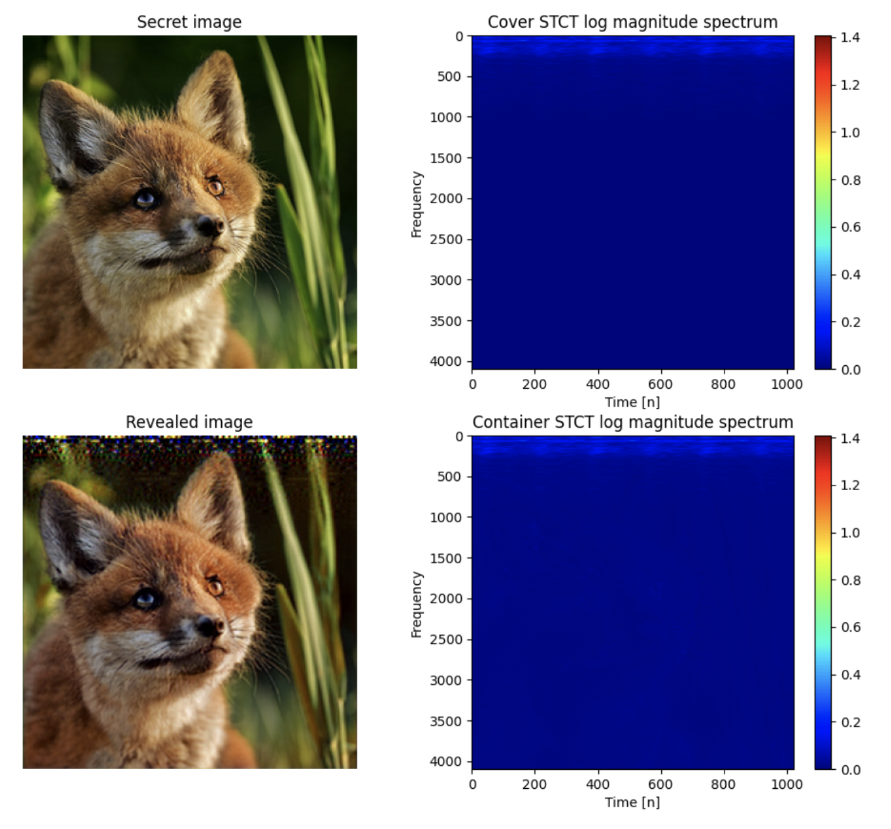

# PixInWav: Residual Steganography for Hiding Pixels in Audio

This repository includes a python implemenation of `StegoUNet`, a deep neural network modelling an audio steganographic function. 

> Steganography comprises the mechanics of hiding secret data within a cover media which may be publicly available with the main premise that the fact that the communication is  taking  place  is  hidden  as  well. 



If you find this paper and implementation useful, please consider citing our work:
```{tex}
@misc{geleta2021pixinwav,
      title={PixInWav: Residual Steganography for Hiding Pixels in Audio}, 
      author={Margarita Geleta and Cristina Punti and Kevin McGuinness and Jordi Pons and Cristian Canton and Xavier Giro-i-Nieto},
      year={2021},
      eprint={2106.09814},
      archivePrefix={arXiv},
      primaryClass={cs.MM}
}
```

## Repository outline

In the `src` folder we find:

- `umodel_rgb_shuffle.py`: the best-performing audio steganography model with RGB images as input.
- `loader_rgb.py`: the loader script to create the customized dataset from RGB image (ImageNet) + audio.
- `trainer_rgb.py`: a script to either train a model from scratch using provided training data or loading a pre-trained `StegoUNet` model for RGB images.
- `umodel.py`: an audio steganography model with B&W images as input.
- `loader.py`: the loader script to create the customized dataset from B&W image (ImageNet) + audio.
- `trainer.py`: a script to either train a model from scratch using provided training data or loading a pre-trained `StegoUNet` model for B&W images.
- `losses.py`: a script with all the losses and metrics defined for training. Uses a [courtesy script](https://github.com/Po-Hsun-Su/pytorch-ssim) to compute the SSIM metric.
- `pystct.py`: [courtesy script](https://github.com/jonashaag/pydct) to perform Short-Time Cosine Transform on raw audio waveforms.
- `pydtw.py`: [courtesy script](https://github.com/Sleepwalking/pytorch-softdtw) to compute SoftDTW as an additional term in the loss function.

In the `scripts` folder we find:

- `train.sh`: a sample `sbatch` script for Slurm used for sending training jobs.

## Dependencies

First, create a virtual environment on your local repository and activate it:
```
$ python3 -m venv env
$ source env/bin/activate
```
The dependencies are listed in `requirements.txt`. Note that you need [PyTorch](https://pytorch.org) v1.7.1 and [TorchAudio](torchaudio) v0.7.2. With `pip` installed, just run:
```
$ (env) pip3 install -r requirements.txt
```

## Data
We use [ImageNet](http://image-net.org) (ILSVRC2012) 10,000 images for training and 900 images for validation. Regarding audio, we use [FSDNoisy18K](http://www.eduardofonseca.net/FSDnoisy18k/) which has 17584 audios for training and 946 audios for validation. Each audio has a different duration, in our case we sample randomly different sections of audios that correspond to 1.5 seconds approximately (67522 samples). 

## Usage
After the installation of the requirements, to execute the `trainer_rgb.py` script, do:
```
$ (env) srun -u --gres=gpu:2,gpumem:12G 
        -p gpi.compute 
        --time 23:59:59 
        --mem 50G python3 trainer_rgb.py 
        --beta [beta_value] 
        --lr [learning_rate_value] 
        --summary "[description_of_the_run]" 
        --experiment [experiment_number]
```
Reserve as minimum 12G of GPU memory per GPU, otherwise you may be CUDA OOM. Or, run the `sbatch` script as follows:
```
$ (env) ./train.sh [experiment_number]
```
Defining all the arguments and hyperparameters in the script beforehand.

By default, `wandb` checkpoints are created when you execute the `trainer_rgb.py` script (you should login into your [wandb](https://wandb.ai) account first). This allows tracking the learning curves in the web application.

If you prefer using `tensorboard` checkpoints, you will need to install `tensorboardX` and add the needed lines of code to save the values. Once it is done, just run in another shell window:
```
$ (env) tensorboard dev upload --logdir 'logs/[timestamp]'
```
Where `logs` is the directory you choose to store your logs.

To train a model from a checkpoint, follow these steps in the `main` function in `trainer_rgb.py`:
```
chk = torch.load('[checkpoint_path]/[checkpoint_name].pt', map_location='cpu')
model = StegoUNet()
model = nn.DataParallel(model)
model.load_state_dict(chk['state_dict'])

[...]

train(
    model=model, 
    tr_loader=train_loader, 
    vd_loader=test_loader, 
    beta=float(args.beta), 
    lr=float(args.lr), 
    epochs=15, 
    slide=15,
    prev_epoch=chk['epoch'], 
    prev_i=chk['i'],
    summary=args.summary,
    experiment=int(args.experiment)
)
```

Different reconstruction losses can be used to train the network. To use the waveform reconstruction loss term, please leave the `dtw` term in the final `loss`.

## License

**NOTICE**: This software is available for use free of charge for academic research use only. Commercial users, for profit companies or consultants, and non-profit institutions not qualifying as *academic research* must contact `mgeleta@uci.edu` for a separate license. 
